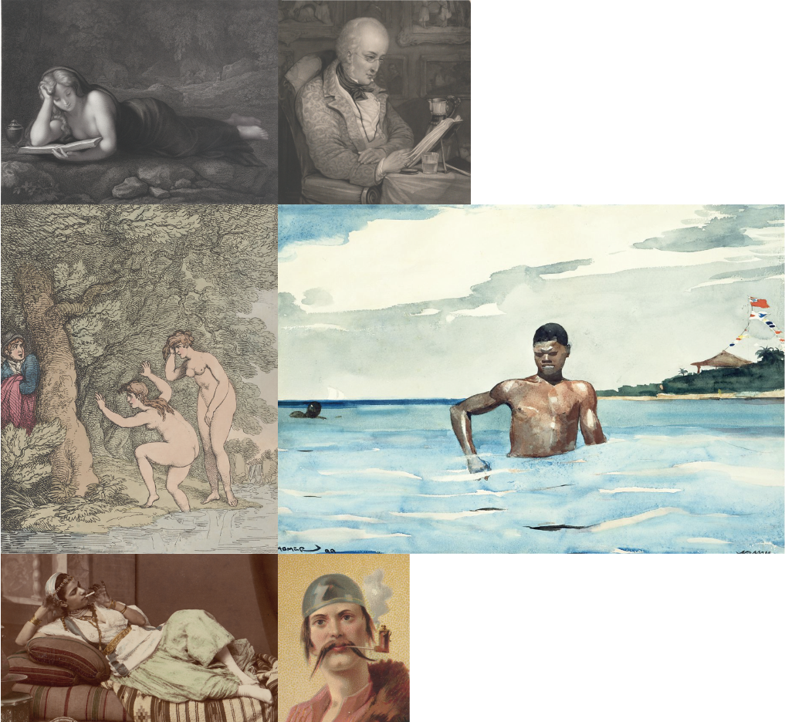

# Women & Men doing things		
## Crowdsourced gender analysis in artworks		
 [working Title]		

  		

  ### Introduction		
 
  ### Concept		
 

  **Question**\		
 

  ### Design Approach		
  
 _____________________________		
 *Header-images from left to right:*\		
 On the Seventeenth Day,13th century rubbing of a 4th century text\		
 Cuneiform tablet: private letter,ca. 20th–19th century B.C.\		
 The Crucifixion,ca. 1495\		
 Bowl with Arabic Inscription, "Blessing, Prosperity, Well-being, Happiness",late 10th–11th century\		
 \		
 \		

  ## Process		

  ### Data		
 #### Search Query in the open access dataset		

  

  #### Data parsing		

  **Time periods:**\		
 -4000-2000\		
 -2000-1000\		
 -1000-0\		
 \		
 0-1000\		
 1000-1400\		
 1400-1600\		
 1600-1800\		
 1800-1900\		
 1900-2000\		

  **Writing techniques**\		
 Written\		
 Inscribed\		
 Weaved\		
 Printed\		

  ### Design		
	

  ### Questions		

 
  ### Attachment: Final draft		
