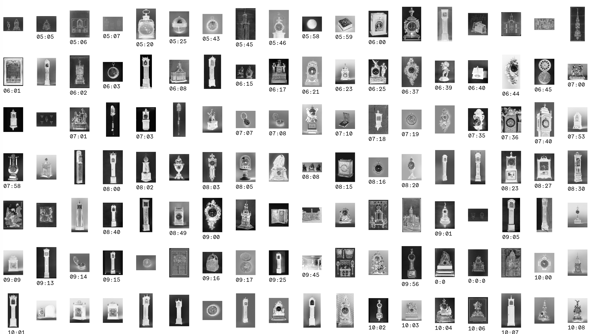

# Blind watches make…		
 ## Artistic approach towards the aesthetic and inherent nature of found watches in the collection	

  		

  ### Introduction		
*Time is a most profound human phenomenon* — Lee Smolin, physicist
*Time is a lack of knowledge* — Carlo Rovelli, physicist and writer
*More space means more time* — Richard Muller, physicist
*The disorder in the universe is constantly increasing* — colloquial description of entropy
*Equation-wise – the first thing to do is to consider time as officially ended* — Sun Ra, Jazzmusician

  ### Concept		
 I saw the tag "clock" in the tags of the MET and wondered at which time a painter actual draws the time, if a clock/watch appears in his 
 painting. So I downloaded all clocks of the open access collection and saw that there also a lot of actual clocks appear.
 The images of in-time-frozen watchs and clocks evoke a very poetic feeling; at some point of history they were used to measure time  

  ### Design Approach		
 The stopped watches 

  ## Process		

  ### Data		
 #### Search Query in the open access dataset		

  

  ### Design		
 I would like to stress the verticallity of the visualization, inspired by long finding of long textscrolls iin the dataset. A centered layout could stress this verticallity. The medium could be printed (poster size) or displayed on screen experiencable via a long scroll.		
 The colors of the sketch are not final. When having the graphic in code, I would also like to try using only grayscale and test if thats still legible.		
 The chosen font *gc16* is serif, but monospaced; a rare mixe. The serif character supports the textual character of the topic; while the monospace nature gives it something modern.		

  The images are for now an example taken from each time period. I will also test to take examples of each Medium.		

  ### Questions		

  — How can I sort first after **time-period,** and then sort again items after **medium** within each time-period?		
 — What is the best practice to realise my sketch (pure html, p5 or d3)?		

 
  ### Attachment: Final draft		
 