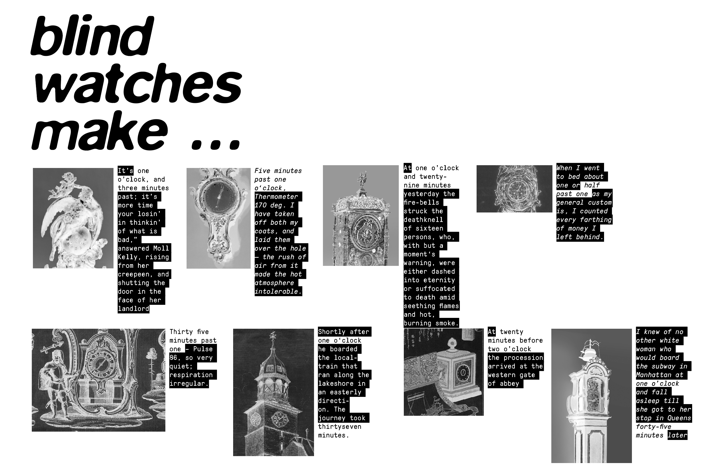
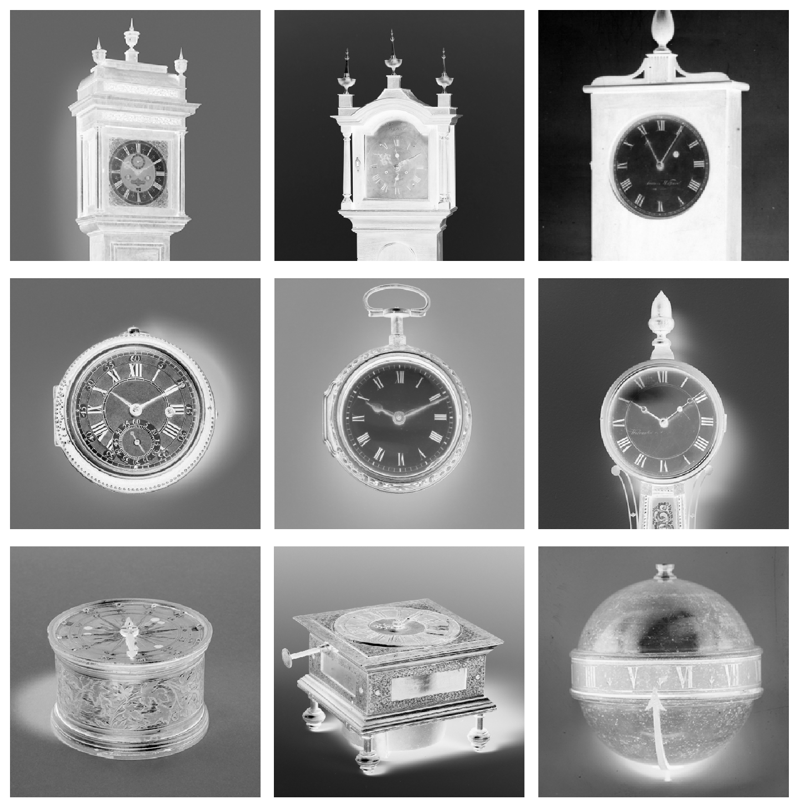
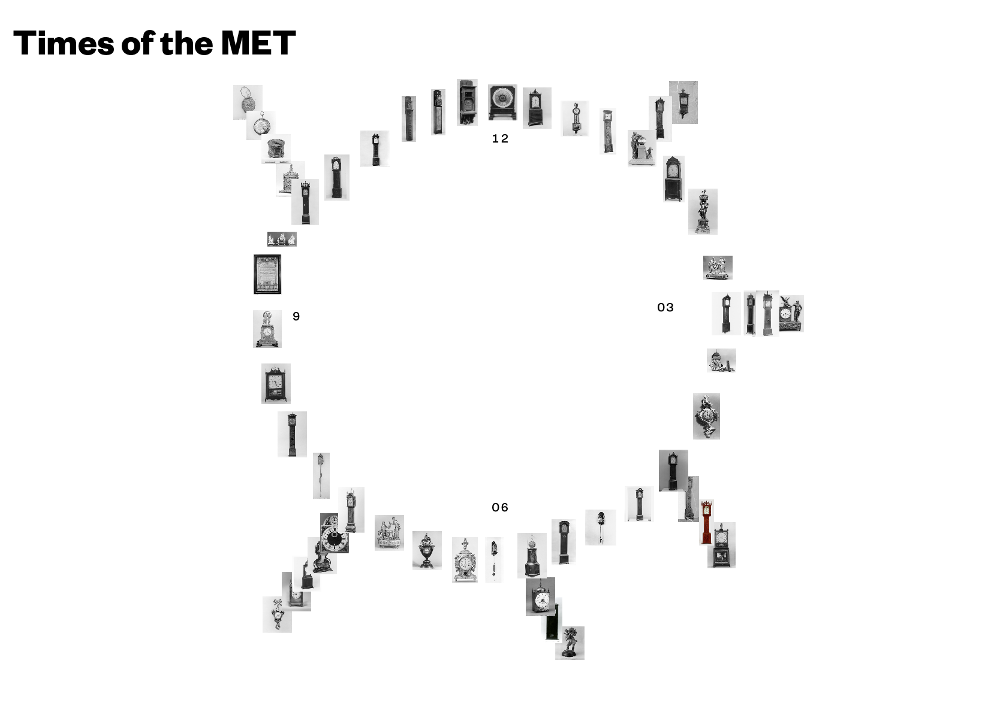
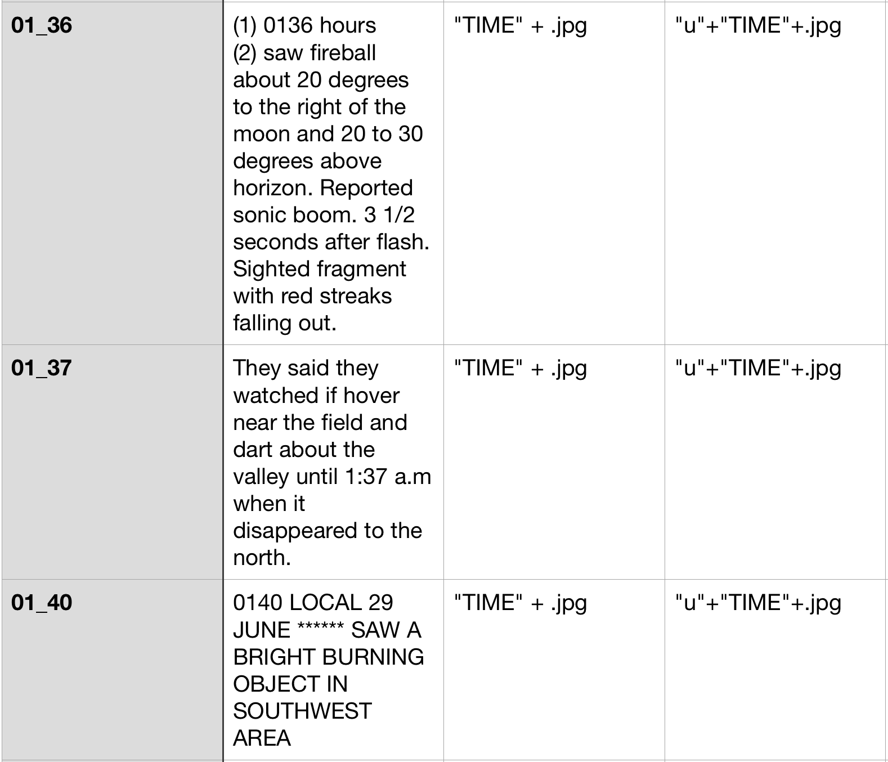

# Blind watches make…		
 ## Artistic approach towards the aesthetic and inherent nature of found watches in the collection	
 [working title, title in analogy to "the blind watchmaker" ]
 
#### **please find final concept/design at the end**

  		

### Introduction		
*Time is a most profound human phenomenon* — Lee Smolin, physicist\
*Time is a lack of knowledge* — Carlo Rovelli, physicist and writer\
*More space means more time* — Richard Muller, physicist\
*The disorder in the universe is constantly increasing* — colloquial description of entropy\
*Equation-wise – the first thing to do is to consider time as officially ended* — Sun Ra, Jazzmusician\

### Concept		
 I saw the tag "clock" in the tags of the MET and started wondering at which time a painter actual draws the time, if a clock/watch appears in his 
 painting. So I downloaded all clocks of the open access collection and realized that  also a lot of actual clocks appear.\
 The images of in-time-frozen watchs and clocks evoke a very poetic feeling; at some point of history they were used to measure time, 
 used to measure the lifes and stories of actual persons; witnessed joy, mourning, significant historical moments and then someday … stopped ticking.
 In this status they remain in the MET Collection since today. Or were they put to a certain time by the photographer while documenting? 

#### Crossreferencing
What if these clocks, just again after 100, 200 years of their standstill, measure another, new story which is constructed through the time in which they stopped? 
It could be interesting to crossreference potential datasets which are documented in time, such as:

* twitter feeds
* minute protocolls
* news
* thematise the value of time (see Process -> Data -> Use of Mechanical Turks
* google books, excerpt where the time occurs (first draft below, real data)
  		

#### References
* Dougloas Gordon — 24 HOUR PSYCHO (https://www.youtube.com/watch?v=UtLg5TqqVeA)
* Christian Marclay — THE CLOCK (https://www.youtube.com/watch?v=BXbQw0rE5UE)
* The blind watchmaker documentary — https://www.dailymotion.com/video/x223a3n
* Space is the Place movie — https://www.youtube.com/watch?v=mZso7bNq-dI
* Space is the Place soundtrack — https://www.youtube.com/watch?v=AZZx0oEdFpc

### Design Approach		
* I inverted the clocks, it maybe increases the poetic visual nature

* I can picture a printed as well as digital environment ( also an audiovisual piece)
Example: Image-slider based Story telling:

* a Visualization visually oriented on the circular Nature of CLocks. Images of Clocks which show the same time are shown at the same position.
Mockup: 

## Process		

### Data		
I used the search query "clocks" and image = true as well as the starter code provided in the lab to download all images.
I then prepared the images and provided them to Amazons Mechanical turk service. Within an hour all images were tagged with the right time.
It took the mechanical turks 7 minutes and 14 seconds in average to decipher each time given in each image. The fee for each image was 0.15 cent.\
\
Most occuring time in 285 images is:
12:00 o clock (eight times)\
10:01 o clock (eleven times)\
09:00 o clock (seven times)\
06:00 o clock (six times)\

## Questions		
What would be an interesting (and conceptional fitting) crossrefence?
Which medium would transports the wanted poetic feeling best?
\
\
\

# Final		

## Through Time to Space

### *Time is a most profound human phenomenon* — Lee Smolin, physicist\
### *Time is a lack of knowledge* — Carlo Rovelli, physicist and writer\
### *More space means more time* — Richard Muller, physicist\
### *The disorder in the universe is constantly increasing* — colloquial description of entropy\
### *Equation-wise – the first thing to do is to consider time as officially ended* — Sun Ra, Jazzmusician\

## Concept
ALl Images showing clocks are downloaded from the MET Open Access Collection. 
In order to find out the time shown in each image, all ca. 300 images were batch processed through Mechanical turk.
As Time and Space are inevitably related the Dataset "Project blue book" (and similiars) was crossreferenced. 
Its content archived (among other) phenomena of how human describe and imagine objects coming from another space/time dimension.
The descriptions supports the poetic visuality of the downloaded clock images. 
Furthermore if the U.F.O files contained images, these images and the clock images are layoutet in juxtaposition to each other.
These contents are then displayed on a Website and shown at the current actual time analog to the time shown on the images.
This kind of visualisation feels more fitting to such a poetic topic. It could be nicely in an installion.\
\
-> https://robincoenen.github.io/Studio-Major/

## Data
An own Dataset was created.

I coded Everything from scratch through javascript ( hardcoded for now. Which is a proof of how clean the new dataset was created. 
However in future I want to reduce the the code and replace it through functions)

## Images from the website

