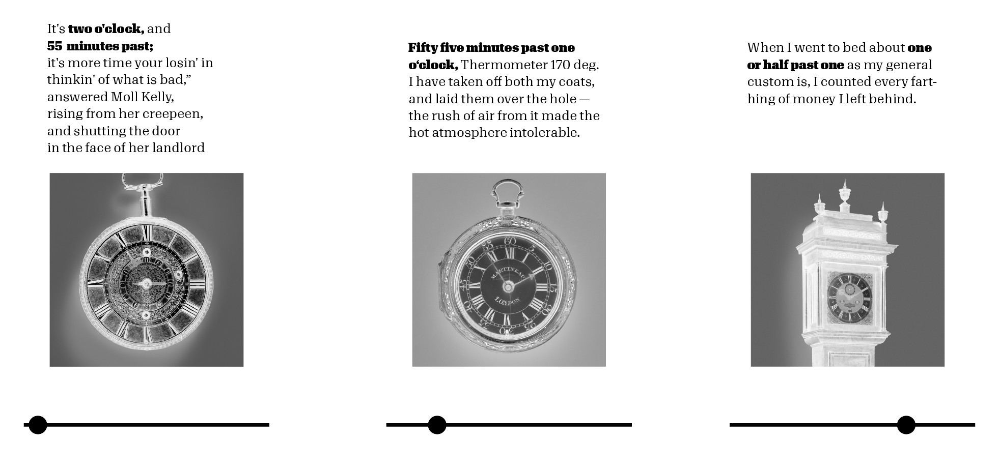

# Blind watches make…		
 ## Artistic approach towards the aesthetic and inherent nature of found watches in the collection	
 [working title, title in analogy to "the blind watchmaker" ]

  		

### Introduction		
*Time is a most profound human phenomenon* — Lee Smolin, physicist\
*Time is a lack of knowledge* — Carlo Rovelli, physicist and writer\
*More space means more time* — Richard Muller, physicist\
*The disorder in the universe is constantly increasing* — colloquial description of entropy\
*Equation-wise – the first thing to do is to consider time as officially ended* — Sun Ra, Jazzmusician\

### Concept		
 I saw the tag "clock" in the tags of the MET and started wondering at which time a painter actual draws the time, if a clock/watch appears in his 
 painting. So I downloaded all clocks of the open access collection and realized that  also a lot of actual clocks appear.\
 The images of in-time-frozen watchs and clocks evoke a very poetic feeling; at some point of history they were used to measure time, 
 used to measure the lifes and stories of actual persons; witnessed joy, mourning, significant historical moments and then someday … stopped ticking.
 In this status they remain in the MET Collection since today. Or were they put to a certain time by the photographer while documenting? 

#### Crossreferencing
What if these clocks, just again after 100, 200 years of their standstill, measure another, new story which is constructed through the time in which they stopped? 
It could be interesting to crossreference potential datasets which are documented in time, such as:

_twitter feeds\
_minute protocolls\
_news\
_thematise the value of time (see Process -> Data -> Use of Mechanical Turks\
_google books, excerpt where the time occurs (first draft below, real data)\
  		

#### References
Dougloas Gordon — 24 HOUR PSYCHO (https://www.youtube.com/watch?v=UtLg5TqqVeA)\\
Christian Marclay — THE CLOCK (https://www.youtube.com/watch?v=BXbQw0rE5UE)\

### Design Approach		
_I inverted the clocks, it maybe increases the poetic visual nature

_I can picture a printed as well as digital environment ( also an audiovisual piece)
Example: Image-slider based Story telling:

## Process		

### Data		
I used the search query "clocks" and image = true as well as the starter code provided in the lab to download all images.
I then prepared the images and provided them to Amazons Mechanical turk service. Within an hour all images were tagged with the right time.
It took the mechanical turks 7 minutes and 14 seconds in average to decipher each time given in each image. The fee for each image was 0.15 cent.\
\
Most occuring time in 285 images is:
12:00 o clock (eight times)\
10:01 o clock (eleven times)\
09:00 o clock (seven times)\
06:00 o clock (six times)\

## Questions		
What would be an interesting (and conceptional fitting) crossrefence?
Which medium would transports the wanted poetic feeling best?

