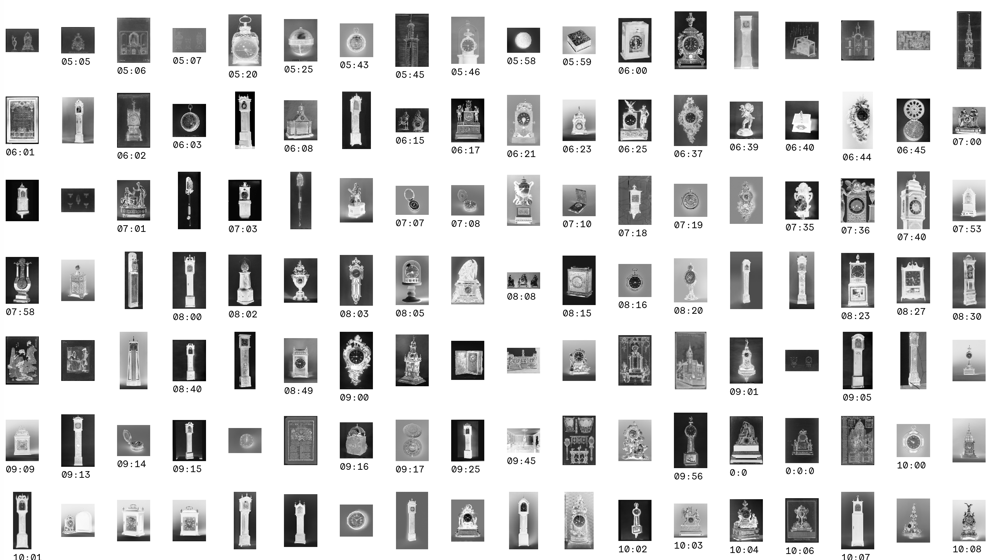
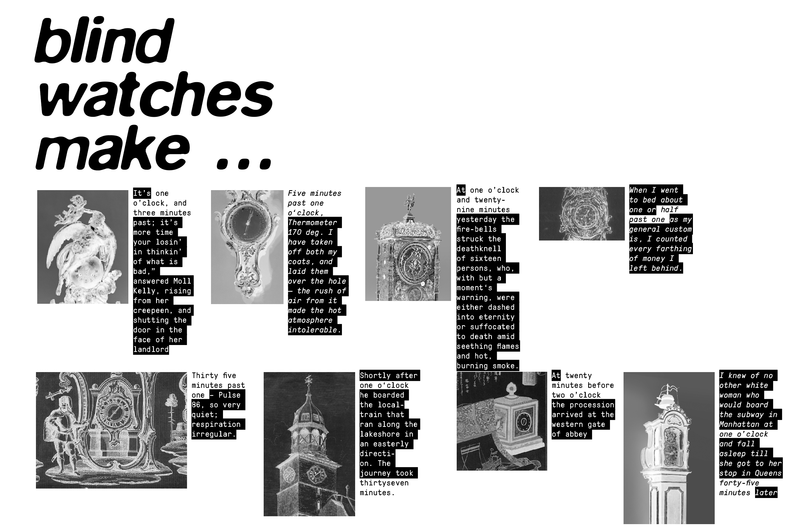
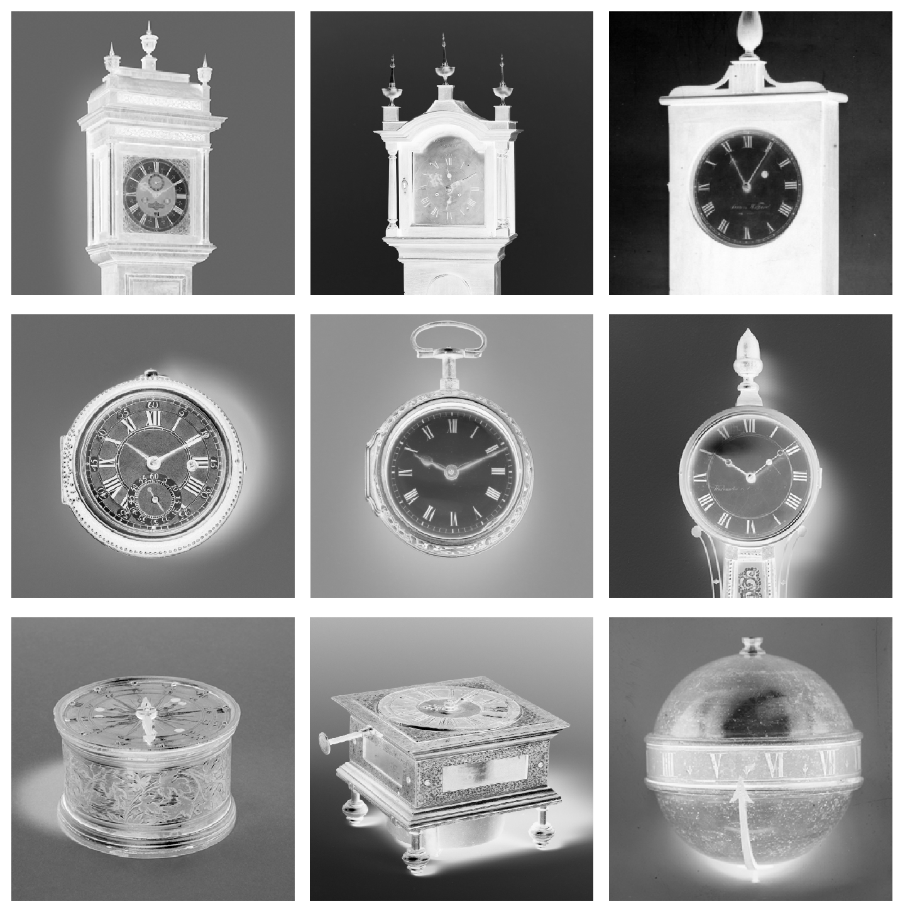
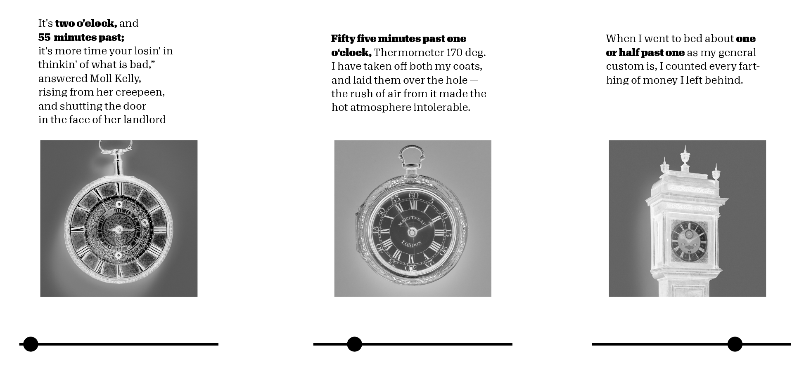
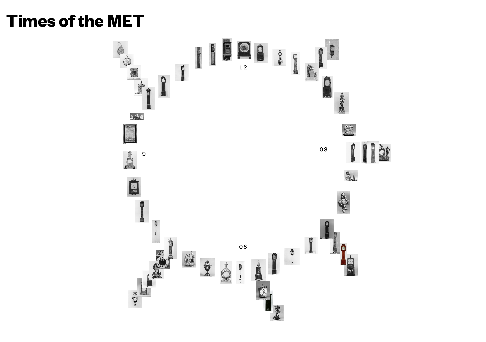
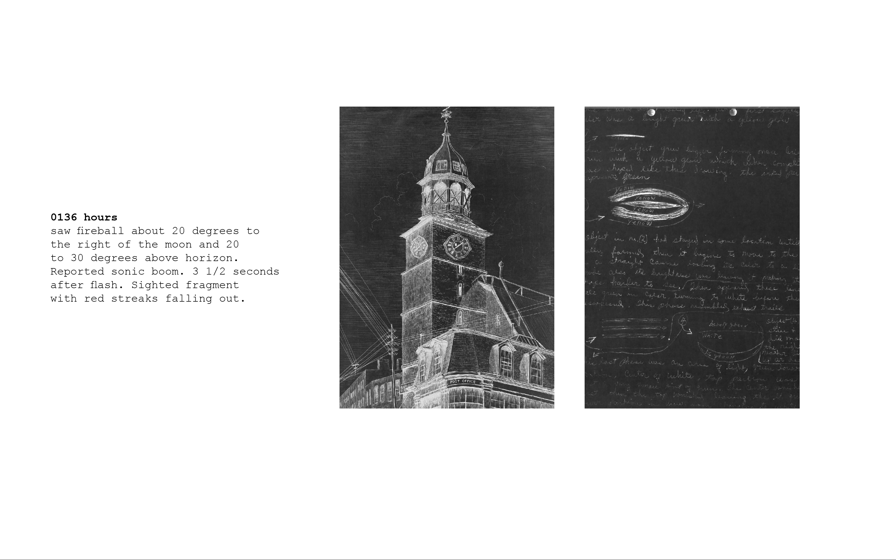
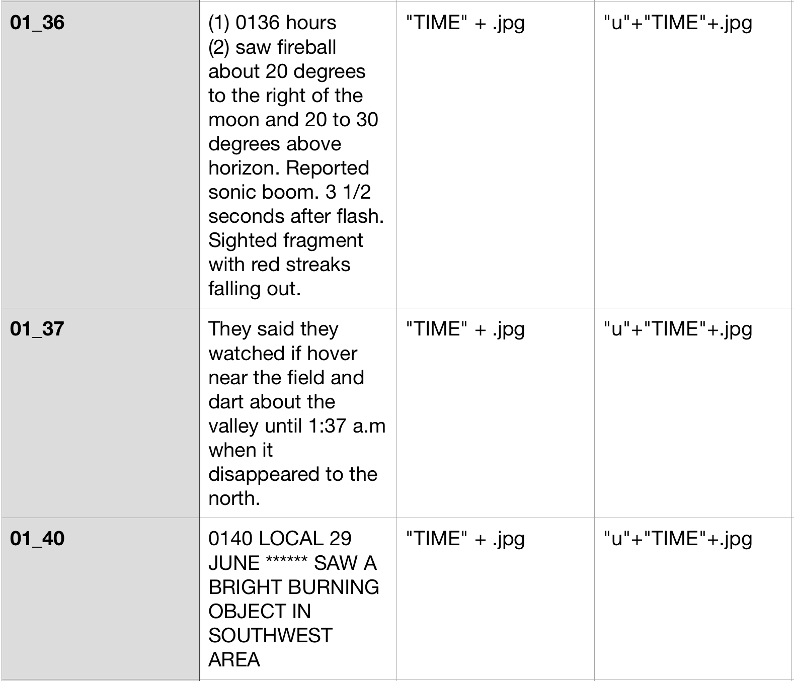
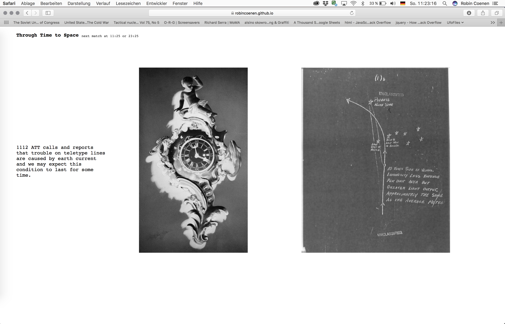

# Blind watches make…		
 ## Artistic approach towards the aesthetic and inherent nature of found watches in the collection	
 [working title, title in analogy to "the blind watchmaker" ]
 
#### **please find final concept/design at the end**

  		

### Introduction		
*Time is a most profound human phenomenon* — Lee Smolin, physicist
*Time is a lack of knowledge* — Carlo Rovelli, physicist and writer
*More space means more time* — Richard Muller, physicist
*The disorder in the universe is constantly increasing* — colloquial description of entropy
*Equation-wise – the first thing to do is to consider time as officially ended* — Sun Ra, Jazzmusician

### Concept		
 I saw the tag "clock" in the tags of the MET and started wondering at which time a painter actual draws the time, if a clock/watch appears in his 
 painting. So I downloaded all clocks of the open access collection and realized that  also a lot of actual clocks appear.\
 The images of in-time-frozen watchs and clocks evoke a very poetic feeling; at some point of history they were used to measure time, 
 used to measure the lifes and stories of actual persons; witnessed joy, mourning, significant historical moments and then someday … stopped ticking.
 In this status they remain in the MET Collection since today. Or were they put to a certain time by the photographer while documenting? 

#### Crossreferencing
What if these clocks, just again after 100, 200 years of their standstill, measure another, new story which is constructed through the time in which they stopped? 
It could be interesting to crossreference potential datasets which are documented in time, such as:

* twitter feeds
* minute protocolls
* news
* thematise the value of time (see Process -> Data -> Use of Mechanical Turks
* google books, excerpt where the time occurs (first draft below, real data)
  		

#### References
* Dougloas Gordon — 24 HOUR PSYCHO (https://www.youtube.com/watch?v=UtLg5TqqVeA)
* Christian Marclay — THE CLOCK (https://www.youtube.com/watch?v=BXbQw0rE5UE)
* The blind watchmaker documentary — https://www.dailymotion.com/video/x223a3n
* Space is the Place movie — https://www.youtube.com/watch?v=mZso7bNq-dI
* Space is the Place soundtrack — https://www.youtube.com/watch?v=AZZx0oEdFpc

### Design Approach		
* I inverted the clocks, it maybe increases the poetic visual nature

* I can picture a printed as well as digital environment ( also an audiovisual piece)
Example: Image-slider based Story telling:

* a Visualization visually oriented on the circular Nature of CLocks. Images of Clocks which show the same time are shown at the same position.
Mockup: 

## Process		

### Data		
I used the search query "clocks" and image = true as well as the starter code provided in the lab to download all images.
I then prepared the images and provided them to Amazons Mechanical turk service. Within an hour all images were tagged with the right time.
It took the mechanical turks 7 minutes and 14 seconds in average to decipher each time given in each image. The fee for each image was 0.15 cent.\
\
Most occuring time in 285 images is:
12:00 o clock (eight times)\
10:01 o clock (eleven times)\
09:00 o clock (seven times)\
06:00 o clock (six times)\

## Questions		
What would be an interesting (and conceptional fitting) crossrefence?
Which medium would transports the wanted poetic feeling best?
\
\
\

# Final		

## Through Time to Space

### *Time is a most profound human phenomenon* — Lee Smolin, physicist\
### *Time is a lack of knowledge* — Carlo Rovelli, physicist and writer\
### *More space means more time* — Richard Muller, physicist\
### *The disorder in the universe is constantly increasing* — colloquial description of entropy\
### *Equation-wise – the first thing to do is to consider time as officially ended* — Sun Ra, Jazzmusician\

## Concept

Created was a website which compares time, appearing on clock-images taken from the MET Open Collection, with the time taken from UFO sighting protocolls.
If the time provided by an clock image from the MET Collection matches the actual current time of the user visiting the website, 
it will be displayed  - along with a text extract from the protocol of an UFO Sighting (and image if available) from the same time -\
and thus creates through their juxtaposition a visual poem about time and space.

The UFO sighting protocolls are interesting artefacts how human imagine and describe obects coming from another space-time continuum.
When seeing an object UFO sighting and reporting it one admits -maybe unconsciously- the existance of another concept of time.

-> https://robincoenen.github.io/Studio-Major/

## Data
An own Dataset was created. The clock images were taken from the Open MET Collection and their time analyzed through Mechanical Turk.
The crosserefenced data set was taken from the "Project Blue Book" (https://en.wikipedia.org/wiki/Project_Blue_Book#Project_Blue_Book_Special_Report_No._14)

Everything is hardcoded from scratch through javascript ( after the presentation on 17th I would like to transform the hardcoded parts into more intelligent code and make the page properly responsive )

## Design
The simple nature of the website puts emphasis on the three shown elements and their juxtaposition: The text extracts from the UFO sighting protocolls, the clock image and if available an image from the UFO protocoll.
The use of an monospace font supports the facsimile-kind nature of the shown elements.
An slowly animated "alert" besides the headline shows when the next match appears; The fact that its animated tells the user that "updates" of the website happens periodically.

## Images from the website

