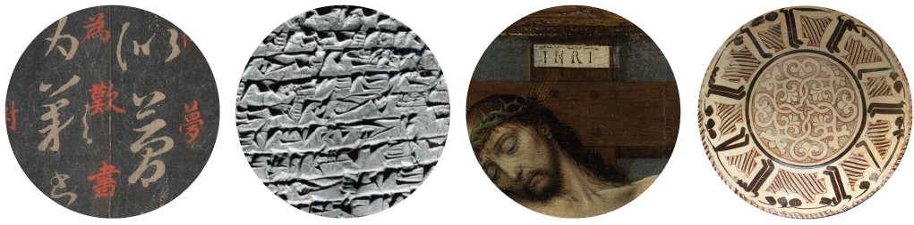
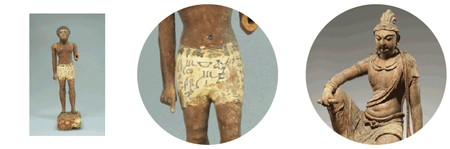

# Writing Traces
## Investigation into the representation of the human writing culture in the most widespread collections of human culture, the Art Collection of the MET
[working Title]

### Introduction
Since April the MET runs an exhibition named "The decorated Word — Writing and Picturing in Islamic Calligraphy" which shows stunning calligraphic artworks from the islamic civilization. 
On its website the MET introduces the exhibition with the sentence: "Calligraphy is a key achievement of Islamic civilization and arguably the most characteristic expression of the Islamic spirit." 
While elaborated calligraphy surely is a key achievement of the islamic civilization, _writing_ itself is definitly one of the most important key achievements of the humandkind. This achievement is furthermore an interesting and broad chimera of different elements, such as technology, art, code, cultural identity and many more — depending from which perspective it is researched.  
Therefore, after visiting the rooms of the "Decorated Word" exhibition, I catched myself going through other exhibitions of the MET in search of _writing traces_ on the artworks. Paintings, vases, installations … which artworks gets along without writing? 
And which one contains an element of writing — any element — no matter if as a motive itself (e.g calligraphy), as a description (e.g picture caption), a label or "brand" ( e.g signature) or content (e.g poems)? 

### Concept
Searching with the keyword "text" _(search?q=text)_ reveals around 10.000 items archived at the open access archive of the MET. 
All this items must be somehow related to the word _text_, for example through their titles, tags, classifications or ~~descriptions~~ (10.09.2019: the presentation of the MET team about the API/Collection makes clear, that descriptions are not part of the dataset.)
Interesting questions to ask are:

**How many artworks are using text, compared to those which doesnt?**\
**What is the temporal development? — Artworks from which era contain the most/ the less text?**\
**Which cultures use most text in which era?**\
**How does the technique/medium of writing change over time?**\
**Are important historical incisions visible (e.g invention of movable letter, invention of paper,…) ?**\
**How does the technique/medium of writing change in different cultures?**\
**How is the museum clustering all kinds of writing? E.g calligraphy, inscriptions, typography etc.**\

### Design Approach
As the data visualisation deals thematically with _text_ in its broadest sense, the visual design might be inspired by the textural appearance, visuality and nature of text. 
The visualisation could be organised in "textblock" alike shapes, readable from left to right (top to down). Furthermore it could use _text_ itself as an dataelement (e.g Titles), which might be especially interesting for an interactive approach.
Different data relations could be visualized with the same visual principle. The image **00_mockup.jpg** should demonstrate this  principle; however a lot of details still need to be worked out. The timeline could of course be much more detailed, the clustering of content (e.g "printed") is not final etc.
_____________________________
*Header-images from left to right:*\
On the Seventeenth Day,13th century rubbing of a 4th century text\
Cuneiform tablet: private letter,ca. 20th–19th century B.C.\
The Crucifixion,ca. 1495\
Bowl with Arabic Inscription, "Blessing, Prosperity, Well-being, Happiness",late 10th–11th century\

## Process

### Data
#### Search Query in the open access dataset

Typography.............5 hits\
Word...................1,228 hits\
Calligraphy............1,237 hits\
Calligraphies..........1,524 hits\
Hieroglyphs............2,389 hits\
Written................2,580 hits\
Letters...............10,257 hits\
\
**Text................10,627 hits**

I decided to take **"Text"** as a search query, although its results also might show items which dont contain visual texts.\
I executed a sampletest with **400 items** and it showed that in average of an amount of **80 items,** around **5** of them dont contain visual texts.
A sample test with word "Letters" resulted in **8** with no visual text content per **80 items.**\
Other search queries might be more exact (e.g Calligraphy), but it misses the very interesting amount of ca. 9500 other visuals which are also interesting in terms of visuality of text, but not tagged as "calligraphy".\

From left to right:\
_Statuette of Merer_ (1981–1802 B.C) — This interesting statuette made out of wood and a shorts with written elements (fashiontipp!) would have been missed, if not searching for _Text_ as a search query.\
_Bodhisattva Manjushri_ (1000–1200) — Example for an element which shows up when searching for text, but does not contain text visually (the sculpture has a closed textscroll in its hand)

#### Data parsing

The following data was parsed from the MET-API:

    var currentID = objectData.objectID;
    var currentTitle = objectData.title;
    var currentBeginDate = objectData.objectBeginDate;
    var currentGeneralDate = objectData.objectDate;
    var currentCulture = objectData.culture;
    var currentCountry = objectData.country;
    var currentNationality = objectData.artistNationality;
    var currentMedium = objectData.medium;
    var currentClass = objectData.classification;
    var currentTags = objectData.tags;
    
It was written into a console and  downloaded via a function which was added into the chrome debugger (http://bgrins.github.io/devtools-snippets/#console-save)

Finally the data which is relevant for my visualization is  the following:

    var currentBeginDate = objectData.objectBeginDate;
    var currentMedium = objectData.medium;
    var currentClass = objectData.classification;

Originally I wanted to sort the data per *Culture*, but only 1500 items of 10500 are tagged with the culture (or country) category.

### Design

### Comments